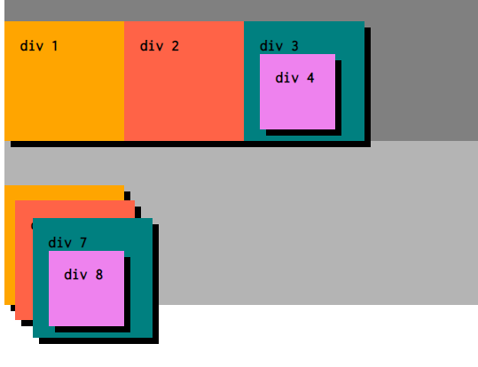

relativeとstatic違い
標準はposition: static;となっており明記はされていないが
relativeと変更してもそれだけでは変わりはない

absolute:親要素を基準に絶対配置をする
relative:現在位置を基準に相対位置を指定する

<relativeが生きる時>
relativeが生きる時は
「子要素にabsoluteが指定されたとき」
「z-indexを指定したいとき」

absoluteは親要素の等のrelativeを見つけたら
relativeの動きはそのまま維持してから動くようになる
逆にstaticだと無視して動く（重なったりする）
↑z-indexも同様

z-index(position!=static)
要素の順位付けで、上の条件でないとできない。
要素数が高いほど前面に表示される。

z-index: auto;とは
ローカルスタックコンテキストは生成されないため
中の要素はルートスタックコンテキストになる

ルートスタックコンテキスト
通常の動き static

ローカルスタックコンテキスト
position: static以外
z-index: を指定したとき

